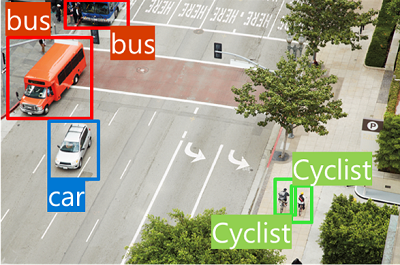

# Computer Vision

## Pengertian
Computer Vision merupakan cabang AI yang berfokus pada pemrosesan visual, seperti gambar dan video.
Salah satu contohnya adalah aplikasi Seeing AI untuk membantu tuna netra dan low vision dengan cara mendeskripsikan lingkungan sekitar mereka.

## Tugas-Tugas Umum
### Image Classification

  
Mengklasifikasikan gambar berdasarkan isinya (misalnya, jenis kendaraan).

### Object Detection

Mendeteksi objek dalam gambar dan menampilkan lokasi objek dengan bounding box.

### Semantic Segmentation

Mengklasifikasikan setiap piksel dalam gambar dan memberikan “mask” berwarna untuk objek tertentu.

### Image Analysis

Memberikan tag dan caption yang menjelaskan konten dalam gambar.

### Face Detection, Analysis, and Recognition

Mengidentifikasi wajah dalam gambar dan dapat diperluas untuk mengenali individu.

### Optical Character Recognition (OCR)

Mendeteksi dan membaca teks (cetak maupun tulisan tangan) dalam gambar.

## Layanan Computer Vision di Microsoft Azure
### Azure AI Vision
Menyediakan berbagai fitur, termasuk Image Analysis, Face, dan OCR.

### Azure Vision Studio
Dapat diujicoba melalui Azure Vision Studio dan diintegrasikan dengan bahasa pemrograman lainnya.

### Dukungan Analisis
Mendukung analisis gambar, deteksi wajah, serta pengenalan teks cetak maupun tulisan tangan.

